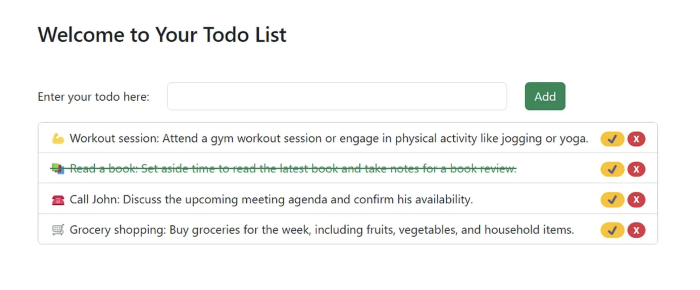
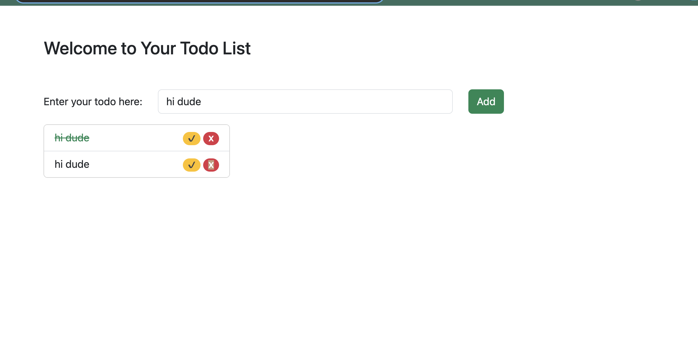
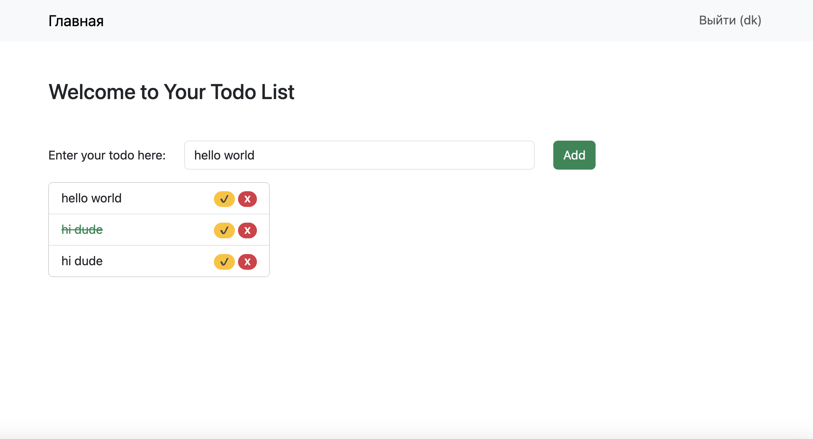

# Простое приложение ToDo List

Простое приложение ToDo List, разработанное с использованием Django Framework, HTMX и Bootstrap 5, предназначено для управления задачами. Это приложение позволяет пользователям добавлять, удалять и отмечать задачи как выполненные.

## Функциональность

- **Регистрация пользователей**: Пользователи теперь могут регистрироваться в приложении, используя стандартную форму регистрации Django. Это позволяет пользователям создавать собственные учетные записи для управления их задачами персонально.


## Технологии

- **Django Framework**: основа приложения, обеспечивает структуру и поддержку моделей, представлений и шаблонов.
- **HTMX**: добавляет интерактивность к веб-страницам без использования JavaScript.
- **Bootstrap 5**: фреймворк для стилизации и создания адаптивного дизайна.

## Установка

Для запуска проекта необходимо установить Python и Django. Также понадобится PostgreSQL как система управления базами данных.

## Установка и настройка settings.py

Для корректной работы регистрации необходимо настроить систему аутентификации и подключить базу данных для хранения данных пользователей.

- **Настройка базы данных в `settings.py`**:
  Убедитесь, что настройки базы данных корректно конфигурированы для использования с Django. Это может включать установку и настройку PostgreSQL или другой поддерживаемой базы данных.

- **Применение миграций для аутентификации**:
  Django использует систему миграций для создания и изменения таблиц базы данных, включая таблицы, необходимые для аутентификации пользователей.
  ```bash
  python manage.py migrate

```bash
# Клонирование репозитория
git clone <url-репозитория>

# Установка зависимостей
pip install -r requirements.txt

# Настройка базы данных в settings.py

# Применение миграций
python manage.py migrate

# Запуск сервера
python manage.py runserver
Использование
После запуска сервера откройте http://localhost:8000 в вашем браузере. Вы увидите интерфейс ToDo List, где можно добавлять, удалять и отмечать задачи.

Вклад
Любые предложения по улучшению приложения приветствуются. Для внесения изменений:

Форкните репозиторий.
Создайте ветку для новых функций (git checkout -b feature)
Сделайте коммиты (git commit -am 'Add some feature')
Отправьте ветку (git push origin feature)
Отправьте pull request.
Автоh Dk

```


## Скриншоты








