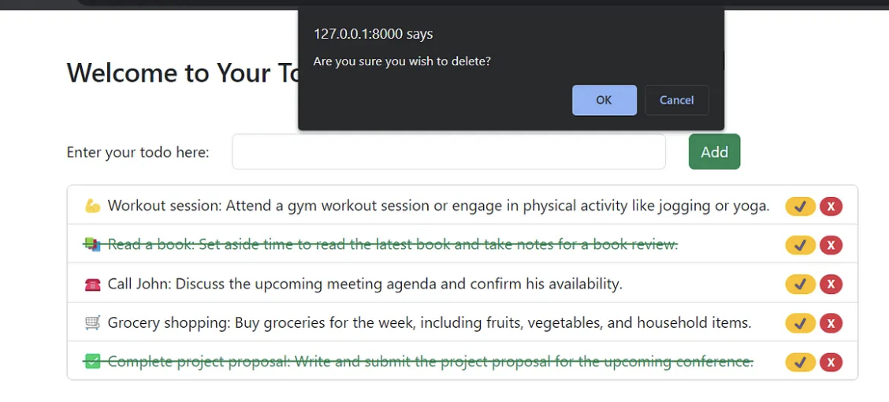

# To-Do List Application

## Project Description

This To-Do List application is designed to help users manage their daily tasks efficiently. Users can add, edit, and delete tasks, as well as mark them as completed. The application is built using Django Framework, htmx, Bootstrap 5, and PostgreSQL for the database.

## Features

- Add new tasks
- Edit existing tasks
- Delete tasks
- Mark tasks as completed
- Responsive design using Bootstrap 5

## Installation

Follow these steps to set up the project on your local machine:

### Prerequisites

- Python 3.x
- Django 3.x
- PostgreSQL

### Steps

1. **Clone the repository:**
   ```bash
   git clone https://github.com/your-username/todo-list.git
   cd todo-list
Create a virtual environment and activate it:

bash
Копировать код
python -m venv venv
source venv/bin/activate  # On Windows use `venv\Scripts\activate`
Install the required packages:

bash
Копировать код
pip install -r requirements.txt
Set up the PostgreSQL database:

Create a database named todolist.
Update the DATABASES setting in settings.py with your database credentials.
Apply migrations:

Копировать код
python manage.py migrate
Create a superuser:

Копировать код
python manage.py createsuperuser
Run the development server:

Копировать код
python manage.py runserver
Usage
To use the application, follow these steps:


Access the application:
Open your web browser and go to http://127.0.0.1:8000/.

Add tasks:
Click on "Add Task" and fill in the task details.

Edit tasks:
Click on the "Edit" button next to the task you want to modify.

Delete tasks:
Click on the "Delete" button next to the task you want to remove.

Mark tasks as completed:
Click on the checkbox next to the task.

Screenshots
Here are some screenshots of the application:





Contribution
Contributions are welcome! If you want to contribute to this project, please follow these steps:

Fork the repository.
Create a new branch (git checkout -b feature-branch).
Make your changes and commit them (git commit -m 'Add some feature').
Push to the branch (git push origin feature-branch).
Open a pull request.
Authors
Your Name
GitHub: your-username
Email: your-email@example.com
Important Notes
Avoid using complex terms and jargon that might be difficult for users to understand.
Include screenshots and code examples to simplify the explanation of how your project works.
Keep the descriptions of your project's features clear and concise.
Use formatting (bold, italics, etc.) to highlight important elements.
Document the project thoroughly, including comments where necessary.